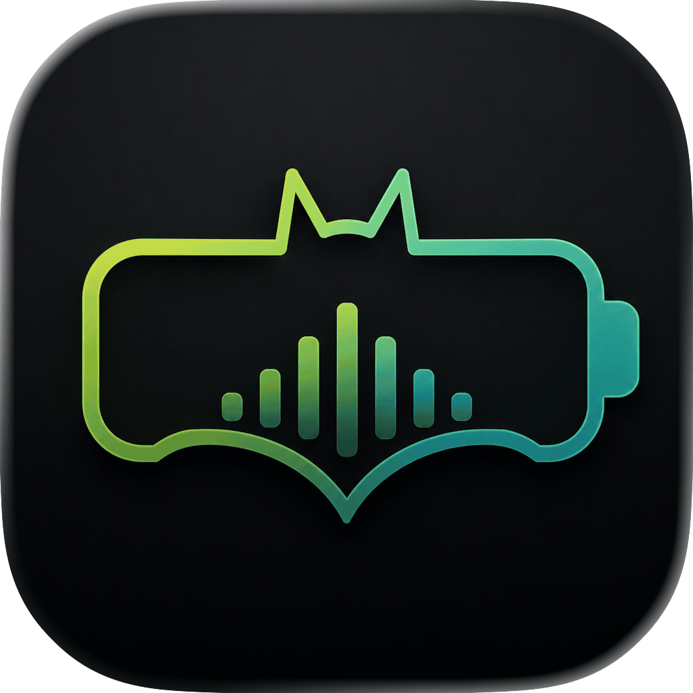
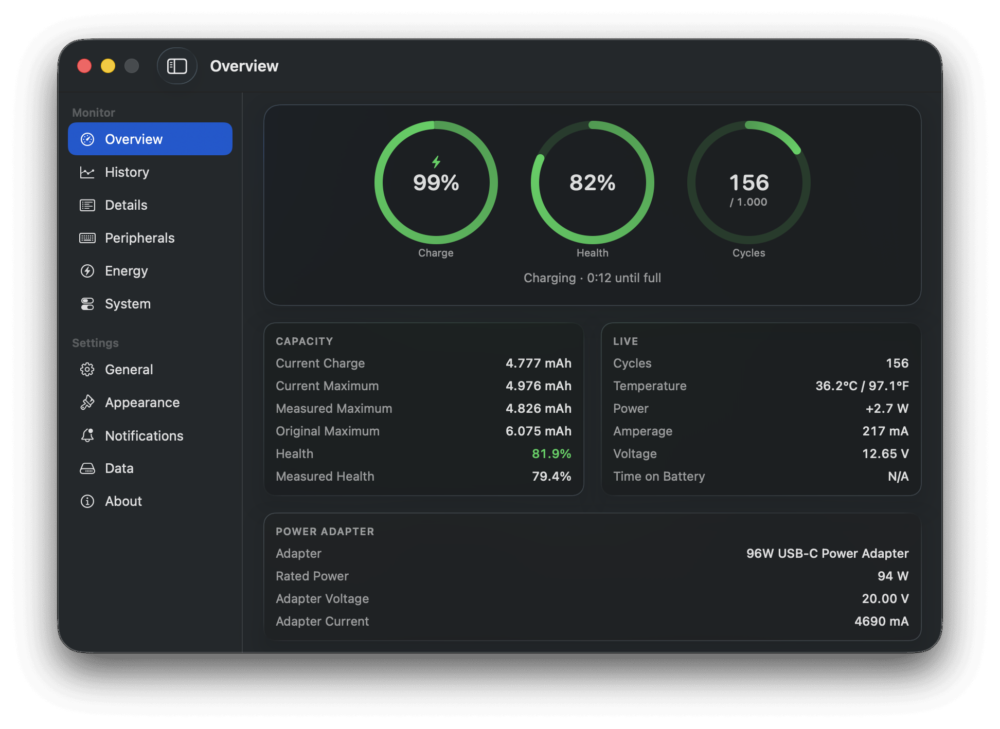
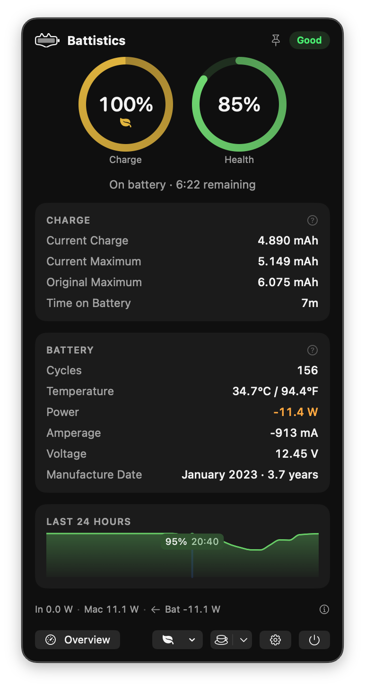
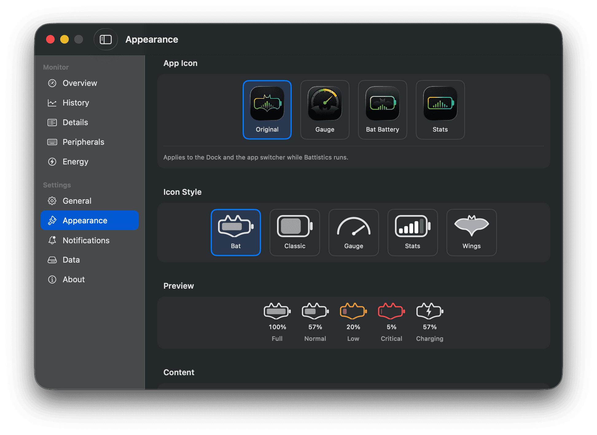

<p align="center">
  
</p>

<h1 align="center">Battistics</h1>

<p align="center">Battery statistics for the Mac. Free, open source, native.<br>
macOS 14+ · Apple Silicon</p>



<p align="center">
  
  
</p>

## Features

- Charge, health, capacity, cycles, temperature, power, voltage and time estimates at a glance
- History charts for charge, power, temperature and health across day, week, month and year
- Customizable menu bar icon: five styles, status colors, optional text, selectable app icon
- Notifications for low battery, full charge, charge limit, high temperature and health decline
- Battery levels of connected keyboards, mice, trackpads and headphones
- Energy view showing the busiest apps, sampled only while open
- CSV export and import of the full history
- English and Turkish

## Light by design

Uses power-change notifications with a low-frequency battery refresh fallback. Detailed views and optional power-history recording add work while enabled. Background activity is minimized, but CPU and energy use vary with settings and hardware; no fixed 0.0% CPU guarantee is made.

## Install

```sh
brew install --cask doguyilmaz/tap/battistics
```

Or download the DMG from [Releases](https://github.com/doguyilmaz/battistics/releases) and drag Battistics to Applications.

Either way updates arrive in-app: Battistics updates itself, so Homebrew is told to leave it alone once installed.

## Build

```sh
brew install xcodegen
make run    # debug build and launch
make test   # unit tests
```

Run `make gen` and open `Battistics.xcodeproj` to work in Xcode.

## Privacy

Runs entirely on your Mac. The only network request is the optional update check.

## License

MIT
